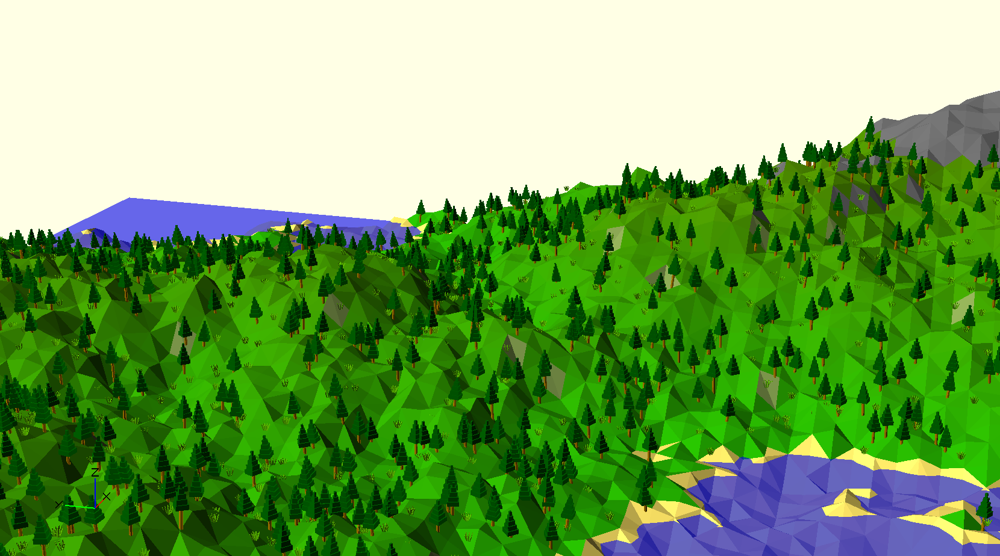

# OpenSCAD Procedural Terrain Generator

This is an OpenSCAD script that procedurally generates a random block of terrain, which includes trees, grass, water, cliffes, beaches and mountains. The script uses the diamond-square algorithm for generating the height map, then goes through several passes to add colour and objects such as trees.

## How to use ##

You will need to install [OpenSCAD](http://www.openscad.org/), which is a free 3D CAD program. Open "Procedural Terrain.scad" in OpenSCAD, then press F5 to "preview" which will generate and display a new block of terrain. You can configure various parameters for the generator at the top of the file such as the smoothness of the terrain or the size of the map it generates (Warning: larger maps than the default quickly lead to long generation times and potential for crashes).
